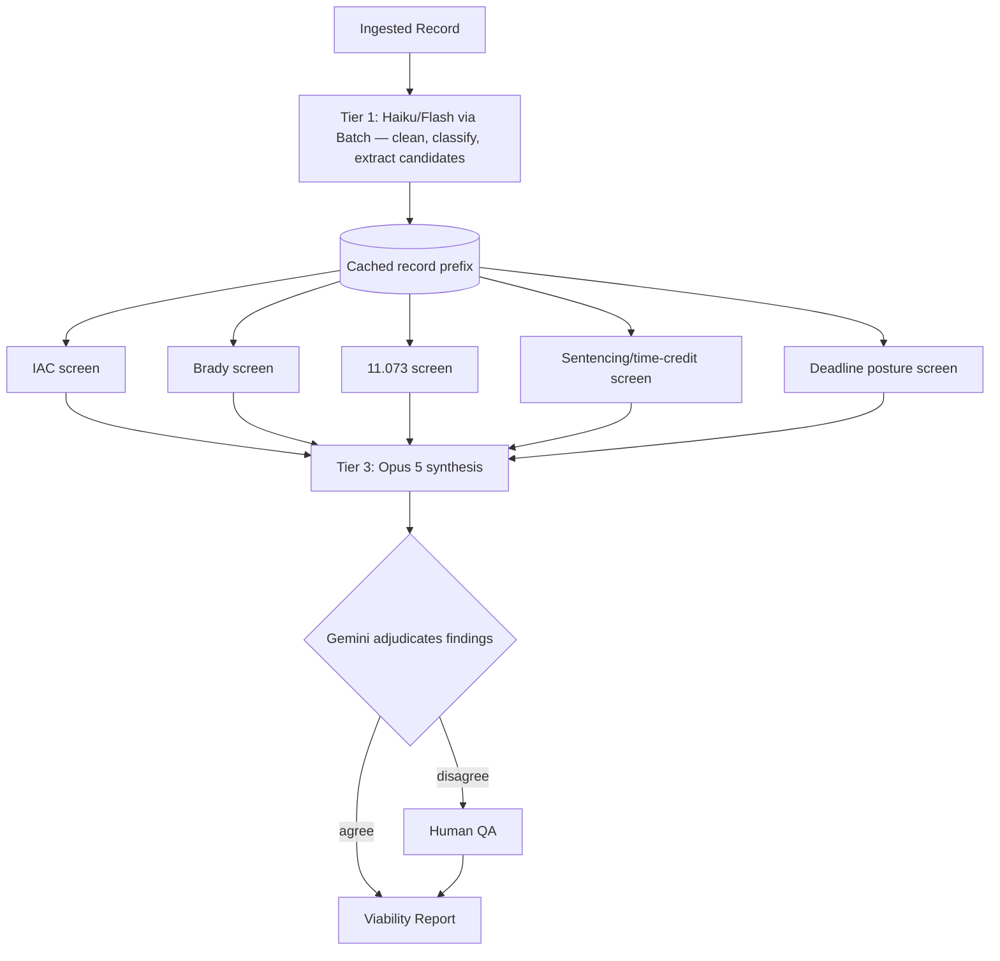

# Cost Optimization: Three-Tier Model Routing (Transform → Screen → Synthesize)

> **Revision (Aug 2026).** This doc previously specified Ollama/Llama 3 as the primary model with Gemini 1.5 Pro as secondary. Manual testing of the two reference case files (`Test Case Files/Gary`, `Test Case Files/Brian Spinks`) showed major output differences between Gemini and Claude on the same records, and the launch business model (family-tier MVP, ~$299/case) changed the cost calculus. The strategy below replaces the old two-model split. **Ollama remains in the architecture but is deferred at launch** — see §5.

## 1. Design principle: cheap models transform, capable models filter

The danger in any cheap-first-pass pipeline is that the first pass acts as a **filter**: whatever it misses, the expensive models never see, and that error is unrecoverable. A missed IAC or Brady signal in the first pass is a silently wrong viability report.

Rule for every router decision:

- **Transform** tasks (OCR cleanup, chunk classification, entity candidate extraction, formatting) → cheapest adequate model. Errors here are recoverable downstream.
- **Filter** tasks (deciding whether something is a finding: IAC, Brady, 11.073, sentencing error) → capable frontier models only. Errors here are unrecoverable.

A local 8B model must never sit in a filter position.

## 2. The three tiers

| Tier | Task | Model | Delivery | Approx. cost / 3,000-page case |
| :--- | :--- | :--- | :--- | :--- |
| **1 — Mechanical** | OCR cleanup, chunk typing, entity candidates | Claude Haiku 4.5 ($1/$5 per MTok) or Gemini Flash | Batch API | ~$1 |
| **2 — Specialist screens** | IAC, Brady, 11.073, sentencing/time-credit, deadline posture (5 passes over the full record) | Claude Sonnet 5 ($2/$10) or Gemini Pro | Batch API + prompt caching | ~$3–4 total |
| **3 — Synthesis + adjudication** | Final viability synthesis from distilled findings (~300–400K tokens); cross-model verification of findings | Claude Opus 5 ($5/$25) synthesis; the *other* engine (Gemini) adjudicates findings only (~50K tokens) | Streaming / standard | ~$5–7 |

**Total: ~$9–12 per case** vs. ~$40+ for dual full-record passes on frontier models with no caching. The unit-economics LLM line is budgeted at **$12/case** (was $5).

### Why not run both engines over everything?

Running Gemini and Claude in parallel on the full record doubles the largest COGS line for less benefit than a targeted cross-check. The cross-model value concentrates at the *findings* level: after synthesis, send each finding **with its cited record excerpts** (~50K tokens) to the second engine as an adversarial verifier.

- Agreement → confidence raised, noted in the report.
- Disagreement → routed to the human QA step (already budgeted at ~30 min/case).

This captures the observed Gemini-vs-Claude divergence as a **feature** (consensus flagging) at ~5% of the cost of dual full passes.

## 3. Cost levers that beat model-swapping

1. **Batch API (−50%).** All Tier 1/2 work runs through the providers' batch endpoints. The pipeline is already async (BullMQ); family-tier reports are not real-time. Anthropic batch halves token pricing; Gemini has an equivalent.
2. **Prompt caching (~0.1× reads).** The five Tier-2 specialist screens re-read the same record. Cache the record chunks once (1.25× write on first screen), then each subsequent screen reads them at ~0.1× — e.g. ~$0.20/MTok instead of $2 on Sonnet 5. Order requests so the record prefix is byte-stable across screens (same chunk order, no timestamps in the prompt prefix), and verify hits via `usage.cache_read_input_tokens`.
3. **1M context windows.** Claude Sonnet 5 / Opus 5 (and current Gemini Pro) fit an entire reporter's-record volume in one request. Prefer whole-volume requests over fine chunking — chunking seams are where cross-volume inconsistencies (the core IAC/Brady signal) get lost.
4. **Page cap as the tail guard.** Model routing controls the average; the 5,000-page cap in the family-tier pricing controls the outlier.

## 4. Router flow

## 5. Where Ollama fits now

- **Launch:** off. At launch volume, per-case cloud spend (~$10) beats a ~$350/mo dedicated-GPU commitment, and local 8B-class quality is not acceptable in any filter position.
- **The `ModelRouter` abstraction stays.** Switching Tier-1 transform work to local inference is a config change, not a re-architecture.
- **Trigger to revisit:** sustained volume ≳150 cases/mo (GPU rent < aggregate Tier-1 API spend), or a data-sovereignty requirement from a Sovereign/B2G customer — the self-hosted tier runs the full pipeline locally by design, accepting the quality/hardware tradeoff explicitly.

## 6. Model choice is an eval question, not an opinion

Observed differences between engines are settled by the recall-first evaluation harness against attorney-labeled ground truth on the two reference cases — see `model_evaluation.md`. No default-model change ships without moving those numbers.
