# MVP v1.0 System Design — Family Case Review

**Status:** Approved for build · **Owner:** Engineering · **Last updated:** 2026-08-29
**Companions:** `../specifications/mvp_v1_prd.md` (requirements) · `../specifications/mvp_workflow_design.md` (S0–S7 blueprint) · `../specifications/mvp_v1_engineering_notes.md` (ENG-1..11 contracts — this doc gives them an architecture) · `../specifications/internal_operations_spec.md` (OPS/SRE/PMX/UXG) · `cost_optimization_ollama.md` (model routing) · `model_evaluation.md` (quality gate)

This is the canonical technical design for MVP v1.0. It supersedes `website_architecture.md` for anything v1.0 touches; that doc remains the long-range professional-tier (v3) reference. Where this doc and an older architecture doc disagree, this doc wins.

---

## 1. Current-state assessment (design starts from what exists, not what docs claim)

A code-level audit (Aug 2026) of the monorepo against the spec set. The platform is a working demo skeleton (~1.2k LOC API, ~250 LOC AI layer) with one production-grade slice. Design implications:

**Keep and build on (genuinely solid):**
- `packages/auth` — NextAuth v4 credentials flow with timing-safe enumeration defense, `passwordChangedAt` session invalidation, remember-me, in-memory sign-in rate limiting, and an unused-but-correct `token.ts` (invite/reset tokens). The best code in the repo.
- SSE progress pipeline — Redis pub/sub → Fastify SSE → `EventSource` works end-to-end (needs auth; see §10).
- Presigned-S3 upload flow (`POST /upload/url` → direct PUT → `/upload/complete`).
- RLS primitives — `withTenant()` transaction-scoped `set_config`, RLS-enabled migration, append-only `AuditLog` trigger (needs `WITH CHECK` and consistent use; see §10).
- BullMQ scaffolding with graceful Redis degradation.

**Finish (half-built):** invite/reset token flow (columns + utils exist; no routes/email/UI) · LangGraph pipeline (real `StateGraph`, but linear, tools never executed, checkpointer never registered, only reachable from a dev CLI) · Neo4j writes (real, but tenant-unscoped and never read).

**Replace (mocked or fake):** document chunking (hardcoded 2-element array; uploaded file never fetched) · entity extraction (string `.includes()`) · workspace chat, knowledge-graph UI, Clio OAuth, PACER webhook, writ-export claims, all business MCP tools (canned JSON).

**Absent entirely:** payments/Stripe · transactional email · OCR · malware scanning · monitoring (Sentry/OTel) · API rate limiting · vector similarity search (embeddings are written, never read) · audit-log writes (the service doesn't compile and nothing calls it) · CI checks.

**P0 defects the design must eliminate (not work around):**
1. **The API has no authentication.** Every route trusts raw `x-tenant-id`/`x-user-id` headers; any client reads any tenant. RLS scopes to whatever tenant the attacker names.
2. RLS policies are `USING`-only — no `WITH CHECK`, so cross-tenant INSERTs pass; `withTenant` is bypassed in several routes.
3. Bull Board at `/admin/queues` is unauthenticated.
4. `DELETE /cases/:id` calls `auditLog.deleteMany` and will throw on the append-only trigger.
5. Neo4j `MERGE (e:Entity {name})` has no tenant scoping — cross-tenant entity collisions.
6. Env-var mismatch (`GOOGLE_GENAI_API_KEY` vs `GEMINI_API_KEY`) — embeddings 401 as configured.
7. Dead/misleading code: unregistered routes (`chat`, `export`, `webhooks`), an orphaned non-compiling document-processor + audit service, a media worker that writes 1536-dim vectors into a `vector(768)` column, hardcoded `http://localhost:3001` in all 14 web fetch sites.
8. `Test Case Files/` — real records with real names in the repo (ENG-10): move to encrypted object storage, gitignore, keep only a manifest.

---

## 2. Architecture overview

```mermaid
graph TD
    subgraph Public["Daybreak consumer surface (Next.js, route group daybreak)"
        L[Landing + /check S0 wizard] --> B["/buy: disclosures → account → Stripe Checkout"]
        B --> C["/case/:id — interview · documents · status · report · next-steps"]
    end
    subgraph Internal["Industrial Authority surfaces (Next.js)"]
        QA["/qa — QA console (ATTORNEY/ADMIN)"]
        OPS["/ops — Ops console (ADMIN)"]
    end

    C -->|NextAuth JWT| API[Fastify API — verifies JWT, derives tenant/user/role]
    QA --> API
    OPS --> API
    Stripe[Stripe] -->|webhooks + reconciliation| API

    API -->|withTenant RLS| PG[(Postgres: cases, CaseEvent stream,\npages, findings, reports, ledgers)]
    API --> S3[(S3: originals, normalized pages,\nreport PDFs, disclosure archive)]
    API --> R[(Redis: BullMQ + pub/sub)]

    R --> W1[intake workers:\nscan → normalize → dedup → OCR → classify]
    R --> W2[analysis orchestrator:\nTier-1/2 batch submit + poll,\nTier-3 synthesis, adjudication]
    R --> W3[report worker:\nground-check → render → deliver]
    W1 & W2 & W3 -->|append CaseEvent| PG
    PG -->|event projections| SSE[SSE tracker · Ops queue · analytics]
    W2 --> LLM[Anthropic batch/standard + Gemini adjudicator\nvia ModelRouter]
    API --> EM[packages/email — Resend\nbounce/complaint webhooks → Ops]
```

**Design principles**

1. **One event stream, many projections (ENG-1/NFR-9).** Every meaningful fact is an append-only `CaseEvent`. Case status, the customer tracker, SSE sub-detail, the Ops queue, stall detection, and analytics are all projections of that stream. No surface computes state independently.
2. **Grounding is a schema, not a prompt (ENG-2).** Findings carry `chunkId + excerptHash` anchors; the report renderer re-verifies every citation against immutable chunks and drops what fails (FR-6/7).
3. **One authority per number (NFR-7/NFR-4).** Billable pages, the SLA clock, and per-case COGS each have exactly one counting authority, read by every surface that displays or bills them.
4. **The customer never touches the AI.** No chat, no graph, no partial findings. The pipeline is internal; the customer sees stage events and, after QA approval, a report.
5. **Reuse deliberately, delete aggressively.** The professional workspace, chat, graph UI, Clio/PACER, and DOCX export are v2/v3 surfaces — their mocked code is removed from registered paths, not "kept for later" where it can leak.

---

## 3. Surfaces, services, and packages

**Language standard (set Aug 2026):** the application language is **TypeScript in strict mode, everywhere** — web, API, workers, and every package extend the shared `@hg/tsconfig` strict base, and `pnpm typecheck` (`tsc --noEmit` per workspace) is a CI gate. No new JavaScript application code; `.js` is tolerated only in tool configs. Runtime is Node LTS. Python appears only in offline tooling (doc/PDF generation, eval scripts), never in the application.

### 3.1 apps/web (Next.js App Router)

```
app/
  (daybreak)/            ← consumer surface (UI spec §4): /, /check, /buy,
                            /case/[id]/{interview,documents,status,report,next-steps}, /help
  (auth)/                ← existing sign-in/reset shell (Industrial Authority) — staff entry
  dashboard/ …           ← existing professional surface; NOT part of v1.0 customer paths
  qa/                    ← US-8 QA console (Industrial Authority)
  ops/                   ← US-9 Ops console (Industrial Authority)
middleware.ts            ← auth + ROLE gating by prefix (see §10.2)
```

All fetches go through a typed API client using `NEXT_PUBLIC_API_URL` (removes the 14 hardcoded `localhost:3001` sites).

### 3.2 apps/api (Fastify) — route modules

| Module | Endpoints (all JWT-authenticated unless noted) | Notes |
|---|---|---|
| `eligibility` | `POST /eligibility/draft` (anon, token-keyed), `GET/POST /eligibility/draft/:token` | S0 answers, 30-day TTL, promoted to case then deleted (ENG-7) |
| `checkout` | `POST /checkout/session`, `POST /checkout/overage`, `POST /checkout/rerun` | Creates Stripe Checkout sessions; prices from config, never client input |
| `stripe-webhooks` | `POST /webhooks/stripe` (Stripe-signature verified) | Idempotent via `PaymentEvent` ledger (ENG-5) |
| `cases` | existing CRUD, reworked: status from projection; delete → OPS-4 workflow only | `DELETE` no longer touches AuditLog |
| `uploads` | presign (per-file limits, content-type allowlist), complete, upload-session resume | ENG-4 |
| `documents` | checklist CRUD, echo-back confirm/correct, page-meter (`GET /cases/:id/pages`) | Meter reads the billable-page authority (§7) |
| `progress` | `GET /cases/:id/progress` (SSE) | Auth + case-access check before subscribe (§9) |
| `reports` | `GET /cases/:id/report`, PDF downloads, `POST /cases/:id/share-link`, share-link access (signed, anon) | ENG-8 |
| `referrals` | consent grant/revoke, directory | US-5, R-6/R-7 |
| `qa` | queue, finding verify/edit/reject, approve (writes snapshot + template version) | US-8; every mutation audit-logged |
| `ops` | case queue, refunds, disclosure-archive export, deletion workflow, delay-ours, reviewer mgmt | OPS-1..7; every action audit-logged |
| `admin` | Bull Board + pipeline health | ADMIN-gated (fixes P0-3) |

### 3.3 Queues and workers (BullMQ)

| Queue | Trigger | Work |
|---|---|---|
| `intake` | upload complete | ClamAV scan → quarantine or pass; HEIC/TIFF→ normalized page images; per-page content + perceptual hash → dedup; page rows written |
| `ocr` | intake pass | OCR provider call per page; confidence stored per page (NFR-6); E-1 halt check runs on rolling case-level confidence |
| `classify` | OCR done | Tier-1 (batch) doc-type classification → echo-back candidate event |
| `analysis` | `DOCS_COMPLETE` event | Orchestrates §6: chunk run, Tier-2 batch submit, **delayed-job polling of provider batch status**, stage-budget watchdog with standard-API fallback (ENG-6), Tier-3 synthesis, adjudication |
| `report` | QA approve | Citation re-verification → page-image pre-render → PDF render → `READY` |
| `notify` | stage-transition events | Resend emails; `DELIVERED` only on confirmed delivery, bounce → Ops (ENG-9) |
| `housekeeping` | cron | Stripe reconciliation (hourly), retention/deletion scans, stall detection is *not* here — `docs.stalled_7d` derives from the event stream (ENG-11) |

The existing `ingestion`/`graph`/`media` queues and their mocked workers are retired. The media queue returns in v1.1 (A/V add-on) built on the Phase-5 design, not the current broken worker.

### 3.4 Packages

- `packages/auth` — as-is + CLIENT role support and API-side JWT verification helper (§10.1).
- `packages/database` — schema deltas (§5), `withTenant` used by **every** tenant-scoped query.
- `packages/case-lifecycle` (new) — the ENG-1 state enum, legal-transition map, customer-visible mapping table, and event-type constants. Single source imported by API, workers, web, and analytics.
- `packages/email` (new, per auth design §2) — Resend + React Email; bounce/complaint webhook handlers.
- `packages/ai` — `ModelRouter` (kept; Ollama config-off per routing doc §5), pipeline stages, prompt assembly with byte-stable cached prefixes, usage accounting with `caseId` metadata on every call (NFR-4).
- `packages/reports` (new) — Part A/B React templates (shared with the web report viewer), versioned; Chromium (Playwright) HTML→tagged-PDF rendering; i18n-ready strings (NFR-2).
- `packages/config` (new) — server-side experiment/config flags with audit-logged admin mutations (SRE-5, PMX-2).

---

## 4. Case lifecycle — the canonical state machine (ENG-1)

```mermaid
stateDiagram-v2
    [*] --> DRAFT: payment.succeeded
    DRAFT --> AWAITING_DOCS: interview complete → checklist
    AWAITING_DOCS --> DOCS_COMPLETE: customer marks complete\n(written once; stamps SLA clock)
    DOCS_COMPLETE --> DIGITIZING
    DIGITIZING --> ANALYZING
    ANALYZING --> ADJUDICATING
    ADJUDICATING --> QA_REVIEW
    QA_REVIEW --> QA_REJECTED: reviewer rejects
    QA_REJECTED --> ANALYZING: re-run screens
    QA_REJECTED --> QA_REVIEW: triage fix only
    QA_REVIEW --> READY: approve (snapshot written)
    READY --> DELIVERED: delivery confirmed
    DELIVERED --> [*]
    REFUNDED --> [*]
    DELETED --> [*]
```



- **Holds are orthogonal flags, not states:** `OCR_HALT` (E-1), `DELAY_OURS` (OPS-7), `SUBSEQUENT_WRIT_MODE` (E-7). A held case keeps its state; the customer-visible stage mapping renders the hold copy ("We need your help with some pages" / "This delay is on us").
- `Case.status` is a **projection column** maintained in the same transaction as the `CaseEvent` append — fast to query, never authoritative over the stream.
- Transition legality is enforced in `packages/case-lifecycle`; an illegal transition throws and pages (it means a worker bug, not a data fix).
- `DOCS_COMPLETE` is written exactly once per run; re-runs (US-6) open a new `AnalysisRun`, never reset the original clock.

**Core event types** (namespaced, versioned): `case.created`, `payment.succeeded|refunded`, `interview.completed`, `doc.uploaded|scanned|quarantined|ocr_done|classified|confirmed|corrected`, `docs.complete`, `stage.entered`, `ocr.halted|resumed`, `screen.completed` (per FR screen, with volume/page counts for honest sub-detail), `adjudication.completed`, `qa.assigned|edited|approved|rejected`, `report.rendered|delivered`, `email.bounced`, `delay.ours_marked|cleared`, `consent.granted|revoked`, `refund.issued`, `deletion.requested|completed`, `rerun.purchased`.

---

## 5. Data model deltas (Prisma)

Existing models (`Tenant`, `User`, `Case`, `CaseAccess`, `Document`, `DocumentChunk`, `AuditLog`, `GraphState`) are kept. Additions/changes, compact form:

```prisma
enum Role { ADMIN ATTORNEY INVESTIGATOR VIEWER CLIENT }   // CLIENT added (ENG-7)

enum CaseStatus { DRAFT AWAITING_DOCS DOCS_COMPLETE DIGITIZING ANALYZING
                  ADJUDICATING QA_REVIEW QA_REJECTED READY DELIVERED REFUNDED DELETED }
enum Lane { TRIAL PLEA }

model Case {            // fields added to existing model
  status         CaseStatus @default(DRAFT)   // projection of CaseEvent
  lane           Lane
  vehicle        String       // 11.07 | 11.072 | ...  from S0 routing
  subsequentWrit Boolean @default(false)      // E-7 flag
  ocrHalt        Boolean @default(false)
  delayOurs      Boolean @default(false)
  county String?  convictionYear Int?         // seeds statute-at-date (FR-5)
  slaStartedAt DateTime?  expectedReadyAt DateTime?   // business-day calendar (ENG-9)
}

model CaseEvent {       // append-only (same trigger pattern as AuditLog)
  id BigInt @id @default(autoincrement())
  caseId String  type String  version Int @default(1)
  payload Json  actor String   // userId | "system" | worker name
  createdAt DateTime @default(now())
  @@index([caseId, createdAt])
}

model EligibilityDraft { token String @id  answers Json  outcome String
  createdAt DateTime  expiresAt DateTime }        // 30-day TTL hard delete (ENG-7)

model Payment      { id, caseId?, userId, stripeId @unique, kind /*review|overage|rerun|refund*/,
                     amountCents, status, createdAt }
model PaymentEvent { stripeEventId @unique, type, processedAt }   // idempotency ledger (ENG-5)

model ChecklistItem { id, caseId, kind, label, state /*NEEDED|UPLOADED|CONFIRMED|PROBLEM*/, howToKey }
model UploadSession { id, caseId, s3Key, parts Json, expiresAt }  // multipart resume (ENG-4)

model DocumentPage {    // the billable-page authority (ENG-3) + OCR record (NFR-6)
  id, documentId, pageNo, s3Key
  contentHash String  perceptualHash String
  billable Boolean         // false when deduped (billing only)
  dedupKind String?        // exact | near — near-dups stay IN the analysis set (§11a.3)
  ocrConfidence Float?  ocrText String?
  @@index([caseId? via document, perceptualHash])
}

model AnalysisRun { id, caseId, runNo, chunkSetVersion, startedAt, completedAt }
model BatchJob    { id, runId, tier, screen?, providerBatchId, status,
                    stageBudgetAt DateTime, fellBackToStandard Boolean }  // ENG-6

model Finding {         // ENG-2 schema, verbatim
  id, runId, stableKey /* hash(category + primary citation) — US-6 diff */
  category, severity, confidence, adjudication /*agree|disagree|not_run*/
  s4ExceptionTags String[]
  partAText, partBText, provenance /*ai|ai_human_edited*/
}
model FindingCitation { id, findingId, docId, volume, page, line?, chunkId, excerptHash }

model Report { id, caseId, runId, versionNo, templateVersion,
               findingsSnapshot Json, partAKey, partBKey, renderedAt }   // ENG-8
model ShareLink { id, reportId, tokenHash, expiresAt, revokedAt?, accessLog Json[] }

model ConsentGrant { id, caseId, recipientClass, scope, grantedAt, revokedAt? }  // US-5
model CostRecord   { id, caseId, source /*model|ocr|storage*/, provider, tokensIn?, tokensOut?,
                     cacheReadTokens?, amountUsd, createdAt }             // NFR-4
model Entity / EntityMention { tenant-scoped entity index for Part B (see §12.1) }
```

`DocumentChunk` gains `runId` (chunks are **immutable per analysis run** — the FR-7 re-verification anchor) and `pageRefs Json` (volume/page/line provenance). RLS is enabled (`USING` **and** `WITH CHECK`) on every new tenant-reachable table.

---

## 6. The analysis pipeline

Implements `cost_optimization_ollama.md` exactly; this section is the engineering shape.

1. **Chunk & freeze.** On `DOCS_COMPLETE`: normalized pages → structured text (Docling for born-digital; OCR text for scans) → hierarchical chunks with volume/page/line metadata → written with `runId`, content-hashed. The chunk set for a run is never mutated (grounding anchor).
2. **Tier-1 (batch, Haiku/Flash):** cleanup, chunk typing, entity candidates. Errors recoverable — nothing here filters.
3. **Tier-2 (batch + prompt caching, Sonnet/Gemini Pro):** the screen set for the case's lane (FR-1..5, FR-5a, FR-11) as 5–7 passes over a **byte-stable record prefix** (same chunk order, no timestamps) so screens 2..n read the cache at ~0.1×. Cache hits verified via `usage.cache_read_input_tokens` and recorded to `CostRecord` — cache-hit collapse is an SRE-2 ticket alert.
4. **Batch asynchrony (ENG-6):** each provider batch gets a `BatchJob` row and a BullMQ delayed polling job; a stage-budget watchdog resubmits via standard API past budget and records the cost delta.
5. **Tier-3 synthesis (Opus, streaming)** over distilled findings; then **cross-model adjudication** (Gemini) per finding with its cited excerpts (~50K tokens). `disagree` → QA-priority flag.
6. **Grounding filter (FR-6/7):** every finding must resolve ≥1 citation to a real chunk; at report render each citation re-fetches its chunk and compares `excerptHash` — mismatch drops the finding and alerts QA.
7. **Modes:** subsequent-writ mode (S0 or E-7 mid-flight) adds §4-exception tagging to every screen's output schema; plea lane swaps the screen set (FR-5a); the deadline engine (FR-5) computes through the **business-day calendar service** (America/Chicago, federal + TX holidays) shared with the SLA promise (ENG-9).
8. **LangGraph:** the orchestrator is rebuilt as a supervisor graph with a real `ToolNode` loop and conditional edges, the Postgres checkpointer actually registered at `compile()`, invoked only by the `analysis` worker — never from an HTTP route.

Eval hooks: every run records per-screen outputs + usage so the `model_evaluation.md` harness can replay configurations against the reference-corpus ledger (read from the encrypted bucket per ENG-10, never the repo).

## 7. Payments & billing integrity (ENG-3/ENG-5, NFR-7)

- **Account before payment** (landing spec W-3): `/buy` creates `User(role: CLIENT)` + single-member `Tenant` in one transaction, then opens Stripe Checkout. **Case creation happens on the `payment.succeeded` webhook**, transactional, idempotent via `PaymentEvent`; the S0 `EligibilityDraft` is copied in and deleted.
- **Reconciliation:** hourly job diffs Stripe charges ↔ `Payment` rows; mismatch pages Ops. A crash between charge and case self-heals; support never hand-fixes.
- **Billable page = one authority:** `COUNT(DocumentPage WHERE billable)` — the live meter, the overage trigger, and partial-refund math all call the same query. Dedup by perceptual + content hash before `billable` is set; the meter response includes `duplicatesIgnored` for the trust note. Partial blocks round down in the customer's favor.
- Overage/re-run are separate Checkout sessions (W-5); no stored-card auto-charges; refunds computed from the page authority, issued only through the Ops console, audit-logged.

## 8. Reports (ENG-8)

- QA **approve** writes the `Report` row: findings snapshot + template version — the exact bytes READY will render. Template changes never affect in-flight cases (SRE-5).
- Cited page images are pre-rendered at approval into S3; the report and share-link render those frozen images, never live source PDFs.
- PDFs: Part A/B rendered from the same React templates as the web viewer via Playwright/Chromium tagged-PDF export; templates i18n-keyed with `es` stubbed (NFR-2). PDF/UA conformance is verified in CI on template changes (open item §14 if tooling falls short).
- Share-with-a-lawyer link: random token (hash stored), 30-day expiry, revocable, access-logged ("your lawyer opened it").
- Re-run diff = set-diff on `Finding.stableKey` + severity/citation changes across runs.

## 9. Progress & notifications

- Workers emit `CaseEvent`s; a thin projector publishes the **customer-visible mapping** (state+holds → stage + honest sub-detail like "Volume 3 of 7 read") to Redis `case-progress:{caseId}`.
- The SSE endpoint authenticates, **verifies case access, and confirms tenant scope before subscribing** (ENG-4); heartbeat comments every 25s; SSE delay p95 < 60s (SRE-1). Internal consoles may subscribe to a verbose channel; the consumer channel never carries legal content pre-QA.
- Emails on major transitions via `packages/email`; `DELIVERED` is only written on confirmed delivery — a bounce keeps `READY` and opens an Ops item (ENG-9). SPF/DKIM/DMARC are launch checklist items.

## 10. Security & tenancy

### 10.1 API authentication (fixes P0-1)
A Fastify `preHandler` verifies the NextAuth JWT (same `NEXTAUTH_SECRET`, using `next-auth/jwt.getToken`-compatible decoding) from the session cookie or `Authorization: Bearer`. Request context (`userId`, `tenantId`, `role`) comes **only** from the verified token; the `x-tenant-id`/`x-user-id` headers are deleted from every route and the frontend client. Anonymous endpoints are exactly: eligibility drafts, Stripe webhooks (signature-verified), share-link access (token-verified), health.

### 10.2 Authorization
- Middleware role-gates prefixes: `(daybreak)/case/**` → CLIENT (own tenant only); `/qa` → ATTORNEY/ADMIN; `/ops`, `/admin/queues` → ADMIN; `/dashboard`,`/workspace` → staff roles, never CLIENT. The API re-enforces the same matrix per route (middleware is UX, API is the gate).
- CLIENT is scoped hard: single-member tenant, own cases only, no permissions/user-management surface (ENG-7).

### 10.3 Data isolation
- All policies get `WITH CHECK` added; RLS pentest is a launch gate (SRE-6); `rls.test.ts` is replaced with integration tests against real Postgres (current test mocks the client and proves nothing).
- `withTenant` becomes the only sanctioned query path for tenant data; a lint rule flags bare `prisma` use in routes/workers.
- Entity index rows carry `tenantId` (fixes P0-5). Deletion workflow (OPS-4) hard-deletes Postgres rows, S3 objects (originals, pages, reports), vectors, and entity rows, then writes a deletion certificate event.

### 10.4 Upload & platform hardening
- Presign enforces content-type allowlist + per-file (500MB)/per-case caps; ClamAV between upload and ingestion; quarantine with plain-language customer message (ENG-4).
- Rate limiting (Redis-backed, replacing the in-memory Phase-1 limiter) on auth, eligibility, presign, and webhook endpoints — launch gate 4a.
- CORS pinned to the web origin (currently `origin: true`); helmet-style headers; Bull Board behind ADMIN auth.
- Audit service rewritten against the real database exports and **wired**: every QA edit, Ops action, refund, deletion, and flag change writes `AuditLog` (currently zero rows are ever written).

## 11. Observability, cost, analytics

- Sentry + OpenTelemetry across web/API/workers (launch gate 4a); pipeline-health board (worker liveness, queue depth, provider latency, batch status) feeds the Ops console rail (SRE-3); alert routing per SRE-2 (page vs. ticket).
- **COGS is a query:** every model/OCR call writes `CostRecord` with `caseId` (including inside batch submissions via metadata); rolling COGS > $54 alerts (NFR-4).
- Analytics: self-hosted PostHog; the `snl.*` taxonomy in `analytics_experimentation_plan.md` §2 is the contract; server-side mirror events for money/pipeline facts; experiment flags in `packages/config` with audit-logged admin UI; no third-party pixels, no session replay on record/report surfaces.

## 11a. Data governance (classification, retention, lifecycle)

Added after data-architecture review (Aug 2026). This section is the single home for data-handling rules; the PRD (NFR-3/NFR-10), ENG-12, OPS-4, and the analytics plan reference it.

### 11a.1 Data classification

| Class | Examples | Handling |
|---|---|---|
| **C1 Case content** (highest) | Uploaded records, page images, OCR text, chunks, findings, reports. Contains third-party PII (victims, witnesses, minors) the customer cannot consent for | Encrypted (S3 SSE-KMS per env; TLS-only bucket policy), tenant-scoped RLS, never in logs/telemetry/analytics, never used for training, never leaves approved processors (provider zero-retention verified) |
| **C2 Customer identity** | Account email/name, relationship, S0 answers, consent grants | RLS-scoped; S0 drafts are C2 even pre-account (facts about a real person's conviction) |
| **C3 Operational metadata** | `CaseEvent`, `AuditLog`, queue jobs, cost records | **PII-minimal by construction**: IDs, enums, counts, hashes only — never document text, never customer free-text. This is what makes long retention of the audit/event skeleton defensible |
| **C4 Financial** | Payment ledger, Stripe ids, refunds, disclosure-ack archive | Retained beyond case deletion (below); card data never touches our systems (Stripe-hosted) |
| **C5 Telemetry/analytics** | `snl.*` events, Sentry, OTel | Pseudonymous ids only; IP truncated; **Sentry/log scrubbing (beforeSend) enforces zero C1/C2 content**; no free-text properties |
| **Eval corpus** | Reference cases (consented) | Encrypted bucket, separate from customer data; customer records enter only via explicit consent + manifest entry |

### 11a.2 Retention matrix (deletion is scoped, not monolithic)

The customer promise "kept 12 months, deleted sooner on request" applies to **C1/C2**. A verified deletion (OPS-4) hard-deletes C1/C2 (rows, S3 objects incl. versions, report artifacts, entity rows) and **pseudonymizes but retains**:

| Data | Retention | Why it survives case deletion |
|---|---|---|
| C1 case content + C2 identity | 12 mo after delivery, or verified request | The promise |
| S0 eligibility drafts | 30 days hard | ENG-7 |
| Disclosure-ack archive (disclosures shown + timestamp + IP; **no case content**) | 24 mo | Dispute/chargeback defense (E-6) outlives the case. **Legitimate-interest retention basis confirmed (product owner, Aug 2026)** — surviving a deletion request is settled, not open |
| Payment ledger (amounts, Stripe ids; name pseudonymized on deletion) | 7 years | Tax/accounting |
| `CaseEvent` + `AuditLog` skeleton (C3, PII-minimal) | 24 mo, then aggregate | Ops/security/dispute record; deletion writes the deletion-certificate event here |
| Analytics events (C5) | 14 mo, then aggregates only | Funnel baselines |
| Backups | 35-day expiry → **deletion propagates fully within ≤35 days**; stated in the privacy policy | PITR |

### 11a.3 Dedup semantics (data-quality guard on ENG-3)

Deduplication has two different jobs and must never conflate them: **exact content-hash duplicates** (identical bytes) are excluded from both billing and analysis; **perceptual-hash near-duplicates** are excluded from billing (customer's favor) but **always included in the analysis set** — a near-duplicate may be a genuinely different page (a stamped vs. clean copy, an annotated version), and silently dropping it from analysis would be the pipeline destroying evidence. Integrity check at `DOCS_COMPLETE`: uploaded-page count = normalized-page count = billable + excluded-exact + near-dup-flagged, reconciled per case; mismatch blocks the run and pages engineering.

### 11a.4 Time and date rules

All timestamps stored UTC. **Legal deadline computation operates on civil dates** (America/Chicago) as DATE values through the calendar service — a legal date is never derived by timezone-converting a timestamp at render time (the classic off-by-one that moves a deadline a day). The SLA clock uses the same rule.

### 11a.5 Event & schema governance

`CaseEvent` types and the `snl.*` taxonomy live in a versioned schema registry (JSON Schema in `packages/case-lifecycle` / `packages/analytics`); CI validates payloads against it. Evolution is **additive-only** (new event versions, never mutated meanings); events are immutable; every projection is rebuildable from the stream. Analytics identity stitching (anonymous visitor id ↔ userId at purchase) is one-way, documented, and never applied to pre-purchase S0 answer events retroactively.

### 11a.6 Reporting data path

PM/UX dashboards (PMX-3) never query the production OLTP: a nightly ELT into a reporting schema (read replica at MVP scale) builds PII-stripped marts — funnel, S0 outcome mix, unit economics, guardrails. Finance numbers come from the server-side mirror events and the payment ledger, not client events.

## 12. Decisions & deviations (with rationale)

1. **Neo4j is deferred out of v1.0.** Nothing in v1.0 renders a graph; Part B's entity index and timeline are served by tenant-scoped `Entity`/`EntityMention` tables in Postgres (simpler OPS-4 hard-delete, one fewer datastore in the RLS story). The graph returns for v2/v3 professional surfaces. This narrows PRD FR-2's "Neo4j entity graph (internal)" wording to "entity graph (internal, Postgres)" — flagged to Product.
2. **Vector search is off the v1.0 critical path.** The routing doc prefers whole-volume prompts over retrieval; nothing reads embeddings today. pgvector stays in the schema; no HNSW index until a consumer exists.
3. **OCR is a hosted provider** (Textract or Google Document AI — decided by a bake-off on the reference corpus's worst scans) behind an `OcrService` interface; per-page confidence is the NFR-6/E-1 signal. ~$1.5/1k pages fits the COGS budget.
4. **PDF via Chromium tagged export** from shared React templates — one template source for web viewer and PDFs beats a second layout system.
5. **WebSockets/socket.io are removed.** Real-time is SSE-only (the dependency is declared and never imported; the chat route is dead code targeting the wrong Fastify version).
6. **Mocked v3 surfaces are unregistered and the mocks deleted** (chat, graph UI, Clio, PACER, writ export, canned MCP tools). The four real stdio MCP servers stay as standalone processes for pipeline tool use where the eval shows benefit.

## 13. Build plan (sequenced by dependency, mapped to launch gates)

| # | Workstream | Contents | Unblocks |
|---|---|---|---|
| 0 | **Security foundation** | API JWT auth, RLS `WITH CHECK` + consistent `withTenant`, CORS/rate limits, Bull Board auth, audit service fixed & wired, env cleanup, dead-code removal, ENG-10 corpus move | Everything; gate 4a |
| 1 | **Case spine** | `packages/case-lifecycle`, `CaseEvent` + projections, schema migration (§5), SSE mapping | 2–6 |
| 2 | **Commerce** | Stripe Checkout + webhooks + ledger + reconciliation, account-at-purchase (CLIENT), disclosures archive, receipts (email pkg) | US-0/1 flows; gate 5 |
| 3 | **Intake** | S0 drafts, interview→checklist, presign hardening, scan/normalize/dedup/OCR workers, page authority + meter, echo-back, records-complete | US-2, E-1/E-2 |
| 4 | **Analysis** | Chunk-freeze, ModelRouter tiers, batch orchestration + fallback, screens per lane, adjudication, grounding filter, deadline engine + calendar, cost telemetry | NFR-1 eval; gate 1 |
| 5 | **QA + report** | QA console, approve-snapshot, renderer + share links, delivery | US-4/8; gate 4 |
| 6 | **Ops + analytics** | Ops console (OPS-1..7), Sentry/OTel + health board, PostHog + flags | US-9; gates 4a |
| 7 | **Launch hardening** | E2E dry runs on both reference cases, eval green, attorney review package, a11y/reading-level CI | Gates 1–5 |

Workstreams 2–3 and 4 can proceed in parallel after 1; nothing ships to the public before workstream 0 is complete.

## 14. Open items

1. PDF/UA (tagged-PDF) conformance depth for Part A — verify Chromium output meets the NFR-2 bar or add a post-processing step.
2. OCR provider bake-off result (decision rule in §12.3) — run against the corpus's worst aged scans.
3. SLA `N` (business days) — ops decision; the calendar service and SRE-1 stage budgets must sum below it with batch worst-case included (ENG-6).
4. Product sign-off on §12.1 (Neo4j deferral) and §12.2 wording changes to PRD FR-2.
5. Reference-corpus bucket + manifest format (ENG-10) — blocks deleting `Test Case Files/` from the working tree.
