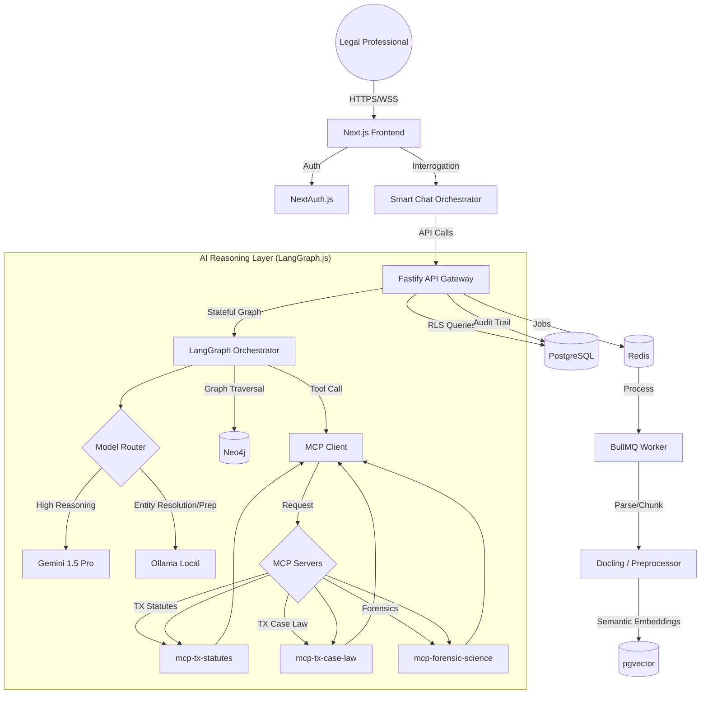

# Legal AI Platform: Website Architecture

## 1. Executive Summary
The Legal AI platform is a specialized tool for Texas post-conviction relief and habeas corpus analysis. It leverages the **Model Context Protocol (MCP)**, a **Legal Knowledge Graph**, and **Stateful Multi-Agent Orchestration** to provide grounded, expert-level legal analysis based on Texas statutes, case law, and forensic science standards.

## 2. Tech Stack

### Frontend (Client-Side)
*   **Framework:** [Next.js 14+](https://nextjs.org/) (App Router) for SSR, SEO, and optimized routing.
*   **Styling:** [Tailwind CSS](https://tailwindcss.com/) for rapid UI development and high-density layouts.
*   **Components:** [Shadcn/UI](https://ui.shadcn.com/) for accessible, consistent, and professional UI components.
*   **Authentication:** [NextAuth.js (Auth.js)](https://next-auth.js.org/) for secure, session-based authentication and IAM.
*   **State Management:** [Zustand](https://github.com/pmndrs/zustand) for lightweight, predictable global state.
*   **Data Fetching:** [TanStack Query (v5)](https://tanstack.com/query/latest) for caching, synchronization, and optimistic UI updates.
*   **Icons:** [Lucide React](https://lucide.dev/) for a clean, consistent icon set.
*   **Rich Text/PDF:** [React PDF](https://react-pdf.org/) for in-browser document viewing and side-by-side analysis.

### Backend (Server-Side)
*   **Runtime:** [Node.js](https://nodejs.org/) (LTS).
*   **Framework:** [Fastify](https://www.fastify.io/) for high-performance API development and native support for JSON schema validation.
*   **ORM:** [Prisma](https://www.prisma.io/) with strict **Row-Level Security (RLS)** for multi-tenant data isolation.
*   **Database:** 
    *   **PostgreSQL:** For relational data (users, sessions, metadata, and **Immutable Audit Logs**).
    *   **pgvector:** For vector embeddings using **Semantic/Hierarchical Chunking**.
    *   **Neo4j:** As a Knowledge Graph to map complex relationships between witnesses, evidence, charges, and trial testimony.
*   **Task Queue:** [BullMQ](https://docs.bullmq.io/) with Redis for background processing.
*   **Document Parsing:** [Docling](https://ds4sd.github.io/docling/) or [Marker] for high-fidelity extraction of structured document data.

### AI Reasoning Layer
*   **Primary LLM:** Gemini 1.5 Pro (via Google AI Studio/Vertex AI).
*   **Local LLM:** **Ollama** (Llama 3) for preprocessing, summarization, and **Entity Resolution**.
*   **Orchestration:** [LangGraph.js](https://langchain-ai.github.io/langgraphjs/) for stateful, cyclical, and multi-agent workflows.
*   **MCP Client:** Custom implementation using the `@modelcontextprotocol/sdk`.

### Infrastructure & DevOps
*   **Containerization:** Docker & Docker Compose for local development and deployment parity.
*   **CI/CD:** GitHub Actions for automated testing, linting, and deployment.
*   **Monitoring:** Sentry for error tracking; OpenTelemetry for distributed tracing.

---

## 3. High-Level Architecture Diagram

---

## 4. Key Architectural Patterns

### 4.1. Stateful Multi-Agent Orchestration (LangGraph.js)
The platform uses LangGraph.js to manage complex legal reasoning:
*   **Persistence:** Graph state is persisted to PostgreSQL, allowing long-running analysis to survive disconnections.
*   **Human-in-the-Loop (HITL):** The orchestrator can "pause" execution to wait for attorney review/edit of a generated CREAC argument before proceeding.

### 4.2. "Smart Chat" Hybrid Reasoning
The central chat interface acts as the primary orchestrator:
*   **Multi-Source:** Queries Neo4j (relationships), pgvector (document text), and MCP (legal ground truth).
*   **Presentation:** Renders "Deep Links" to specific transcript lines and interactive Graph Snippets.

### 4.3. Document Pipeline & Entity Resolution
*   **Semantic Chunking:** Chunks retain hierarchical metadata (Page/Line, Speaker, Header) to ensure the LLM understands document context.
*   **Entity Resolution (Ollama):** A local model normalizes entities (e.g., John Smith vs. Officer Smith) before they are committed to the Knowledge Graph.

### 4.4. Immutable Audit Trails
For legal defensibility, every significant AI tool call, graph query, and final synthesis is logged to an append-only, tenant-isolated audit table.

### 4.5. Zero-Retention Mode & Streaming
*   **Incognito Analysis:** High-security mode using ephemeral storage and local processing.
*   **SSE Streaming:** Real-time token delivery for responsive chat interactions.

---

## 5. CI/CD & Testing Strategy

### 5.1. Testing Framework
*   **Unit/Integration:** Vitest for fast, concurrent testing.
*   **E2E Testing:** Playwright for critical path testing (login, upload, analysis).
*   **Mocking:** `msw` for API mocking.

---

## 6. Implementation Phases

1.  **Phase 1: Foundation (Weeks 1-2)**
    *   Monorepo initialization (Turborepo).
    *   Authentication (NextAuth) and Tenant-Aware Prisma setup (RLS).
2.  **Phase 2: Document & Graph Core (Weeks 3-4)**
    *   BullMQ worker with Docling/Semantic Chunking.
    *   Neo4j schema and Entity Resolution pipeline.
3.  **Phase 3: Smart Chat & LangGraph Integration (Weeks 5-7)**
    *   LangGraph state machine implementation.
    *   Smart Chat with "Review & Refinement" UI.
4.  **Phase 4: Texas Use Cases & Export (Weeks 8-10)**
    *   Specialized Agents (IAC, Brady, Junk Science).
    *   **Writ Formatter:** CREAC argument generation and DOCX export (TOA/TOC).
