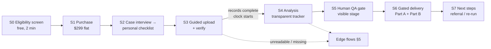

# MVP v1.0 Workflow Design — Family Case Review Service Blueprint

**Status:** Draft for design/engineering review · **Owner:** Product · **Last updated:** 2026-08-29
**Companions:** `mvp_v1_prd.md` (requirements; US-x references below) · `product_roadmap.md` · `docs/design/user_journeys.md` (Persona 4, Workflow E — this doc is its detailed blueprint)

## 1. Method

The workflow below is derived from (a) the family persona's JTBD and pain points, and (b) researched patterns from the closest analogous services — guided document intake (TurboTax, Boundless, SimpleCitizen, Atticus), high-stakes results delivery (Cleveland Clinic/Stanford/Dana-Farber second opinions, 23andMe sensitive-report gating), human-in-the-loop review services (TurboTax Live, Flightright, Stripe Atlas), prison-family UX constraints (JPay/Securus habits, Ella Baker Center "Who Pays?" data, Texas records-access mechanics), and service-blueprint/operational-transparency research (NN/g; Buell & Norton 2011). Each stage names its pattern source.

**Three research facts that shape the whole design:**
1. **The buyer is likely a low-income woman on a phone, already carrying case-related debt** ("Who Pays?": 63% of court costs borne by family, 83% of those women), habituated to per-transaction prison-tech pricing (JPay e-stamps, $0.06/min calls). → Mobile-first, plain language, and the $299 price stated as *"one price. No per-page fees, no add-ons"* — a direct contrast to what this audience is used to.
2. **The turnaround clock must start when records are complete, not at purchase** — the universal norm across medical second-opinion services (Cleveland Clinic: 3–5 days *after records arrive*; Dana-Farber: 7–14 business days *after records complete*). Multi-volume transcripts arrive raggedly; a purchase-anchored SLA is a broken promise waiting to happen.
3. **The reporter's record is the hidden dependency.** A Texas trial transcript is ordered from the individual court reporter at per-page rates (~$1,500/trial day by one practitioner estimate, up to 120-day delivery) — potentially 5–20× the product price. But for convicted felonies it *usually already exists* from the direct appeal. The intake interview must establish this before payment, and the product must teach families how to get the existing record cheaply (district clerk, re:SearchTX for 2016+ e-filings) rather than silently assume they have it.

## 2. The workflow at a glance

## 3. Stage-by-stage blueprint

Format per stage: what the customer does / what they see (frontstage) / what happens behind the line of visibility (backstage) / which JTBD-pain it serves / pattern source / PRD hook.

### S0 — Free eligibility screen (before any payment) — *new requirement, see §6*
- **Customer:** answers ~6 questions, under 2 minutes, no account: Texas conviction? felony? trial or plea? direct appeal filed/decided? roughly when? anyone currently represented?
- **Frontstage:** one question per screen, checkbox-driven, reassurance microcopy (TurboTax pattern). Ends in one of three outcomes: *Good fit* → continue; *Not a fit* (e.g., case still on direct appeal, out-of-state) → plain explanation + pointed resources (TCDLA referral, TIFA); *Fit, but records likely missing* → records-guidance page first (see S2).
- **Backstage:** outcome logged (anonymous) for funnel analytics; no case created.
- **JTBD/pain:** prevents selling a $299 product to a family it cannot help — the single most important trust decision in the flow; also the conversion front door (Atticus's 2-minute triage; Flightright's instant eligibility check).
- **PRD:** new US-0 (added, §6).

### S1 — Purchase
- **Customer:** creates email/password account, pays $299 via Stripe Checkout.
- **Frontstage:** before the pay button: the price framed against alternatives (*"A lawyer charges ~$3,000 to review these documents. Medical second opinions cost $1,000–$2,000. This review is $299 — one price, no per-page fees"*); the 5,000-page cap; the refund policy; the turnaround framing (*"most reviews are ready within N business days of your documents being complete"*); the information-not-legal-advice statement; who reviews the report (named role — see S5).
- **Backstage:** case + single-member tenant created; receipt emailed.
- **JTBD/pain:** cost-versus-outcome anxiety; the transparent flat price is itself the positioning.
- **Pattern:** transparent one-time pricing as contrast to prison-tech nickel-and-diming; TurboTax Live's up-front naming of the human reviewer credential.
- **PRD:** US-1.

### S2 — Case interview → personalized document checklist
- **Customer:** answers a short guided interview about the case (county, year, court, jury/bench, appeal history, current facility).
- **Frontstage:** the interview *generates a personal checklist* — not a generic upload zone: judgment & sentence; indictment; clerk's record; reporter's record volumes ("your trial lasted about 4 days — expect 4–8 volumes"); appellate opinion if appealed. Each checklist item carries a **"Don't have this? Here's how to get it"** expander: district clerk contact info by county, re:SearchTX for 2016+ e-filings, expected cost ($1/page certified at many clerks), and the crucial reassurance that *the trial transcript usually already exists if there was a direct appeal*. Save-and-resume by default — records arrive over weeks.
- **Backstage:** checklist template selected from interview answers; case metadata seeds the pipeline (county → local practice notes, year → statute-at-date for FR-5).
- **JTBD/pain:** "I don't know what documents I need or how to get them" — the pain no incumbent even acknowledges, because their users are lawyers.
- **Pattern:** TurboTax life-event checklist; Boundless expert-built checklist; Cleveland Clinic "we collect your records" (the full concierge is a v1.1 candidate, §6 — v1.0 ships the guidance, not the service).
- **PRD:** US-2 (extends it: checklist is interview-generated, not static guidance).

### S3 — Guided upload & verification
- **Customer:** uploads PDFs or phone photos per checklist item; confirms what the system read.
- **Frontstage:** per-item upload embedded in the checklist (SimpleCitizen pattern — upload where it's relevant, not a bulk dropzone); phone-capture coaching ("flat surface, good light" — TurboTax W-2 pattern); after processing each item, an **echo-back card**: "This looks like *Reporter's Record Vol. 3, pages 1–214, State v. ___*. Right?" Confirm/correct. Running page meter against the 5,000-page cap with the $49 overage offered in-flow. A/V files rejected with the friendly v1.1 note. When the checklist is green: **"Your records are complete — your review clock starts now"** (explicit event, celebrated).
- **Backstage:** presigned-S3 upload; OCR with per-page confidence stored (NFR-6); document classification (Tier-1 routing); low-confidence pages flagged early — *before* full analysis spend (US-7 halt).
- **JTBD/pain:** "my scans are messy and I'm not sure I did it right" — the echo-back is the trust move; early OCR gating protects both refund economics and the family's time.
- **Pattern:** TurboTax OCR echo-back; second-opinion records-complete clock.
- **PRD:** US-2, US-7; NFR-6.

### S4 — Analysis with operational transparency
- **Customer:** waits — but watches honestly-real progress.
- **Frontstage:** a five-stage tracker (Domino's pattern): **Documents received → Digitizing your records → Analyzing the record → Quality review → Ready**, with live sub-detail drawn from real pipeline events ("Volume 3 of 7 read · 412 pages analyzed · cross-checking witness testimony"). Email at each major transition. No chat, no partial findings — nothing legal is shown until QA approves.
- **Backstage:** three-tier model routing (`cost_optimization_ollama.md`): batch transform → five cached specialist screens → synthesis + cross-model adjudication; disagreements flagged for QA; per-case cost telemetry (NFR-4).
- **JTBD/pain:** multi-day silence is where anxiety and chargebacks grow; operational transparency research (Buell & Norton) shows visible work *raises perceived value* — and ours is real work, not illusion.
- **Pattern:** Domino's tracker; labor-illusion research; Stripe Atlas milestone emails.
- **PRD:** US-3.

### S5 — Human QA gate (visible to the customer as a named stage)
- **Customer:** sees "Quality review — a trained legal reviewer is checking every citation in your report against your documents."
- **Frontstage copy rule:** name the reviewer's *role and task* concretely. Research caveat: vague "human-supervised AI" scores *worse* than either humans or AI alone (Kaur Nagpal 2026); specific beats generic ("checks every citation against your transcript"), and credential framing is TurboTax Live's entire premium brand.
- **Backstage:** internal QA console (US-8): reviewer works the adjudication-flagged findings first, verifies citations click-through to source pages, edits Part A language for reading level, approves or rejects to engineering triage; all edits audit-logged. Target ~30 min/case.
- **Cross-persona note:** this is the **attorney/QA internal persona** running a constrained version of the professional side-by-side workspace — v1.0 dogfoods the v3 product daily.
- **PRD:** US-8; launch gate 4.

### S6 — Gated, education-framed delivery
- **Customer:** notified "your report is ready" → passes through a short interstitial before opening.
- **Frontstage:** the interstitial (23andMe sensitive-report pattern): what the report can and cannot tell them, that it may not contain hoped-for news, view-now-or-later choice. Then the two-part PDF (US-4): Part A plain-English (Strong signals / Possible issues / Nothing found), Part B attorney-ready packet. **Every "nothing found" or bad-news page pairs the news with a next step** — never a dead end (23andMe's embedded genetic-counselor referral is the model): consult-counsel guidance, the State Bar lawyer referral service, TIFA peer support, clemency/parole information where relief grounds are thin.
- **Backstage:** report generator enforces the grounded-citation hard filter (FR-6/7); delivery recorded; retention clock starts.
- **JTBD/pain:** "don't drain the family's savings on false hope" cuts both ways — an honest *no* delivered with dignity and a next step is the product keeping its promise.
- **PRD:** US-4; R-1–R-3.

### S7 — Act: referral, attorney handoff, re-run
- **Customer:** optionally (a) consents to share Part B with an innocence clinic, (b) takes the vetted-attorney list, (c) later buys a $99 re-run with new documents.
- **Frontstage:** consent screen names recipient class and exactly what is shared; default private; revocable. The attorney handoff is designed for the *attorney's* JTBD too: Part B opens with a one-page summary an attorney can assess in five minutes — the artifact that converts the ~$3,000 review into a shorter, cheaper engagement (and seeds v3 Advocate-tier demand).
- **Cross-persona notes:** a consented strong-signal packet is the **Clinic Director's** dream intake — pre-triaged, cited, structured (the v2 Justice-tier funnel; metric: ≥20% opt-in). Part B's timeline/entity index is the embryo of the **Mitigation Specialist's** graph view — same data, professional lens later.
- **PRD:** US-5, US-6.

## 4. Blueprint summary table

| Stage | Line of interaction (customer) | Frontstage | Backstage | Support |
|---|---|---|---|---|
| S0 | Answers 6 questions | Triage wizard, 3 outcomes | Funnel logging | — |
| S1 | Pays $299 | Checkout + trust framing | Case/tenant creation | Stripe |
| S2 | Case interview | Personal checklist + get-it guides | Template selection, metadata seed | County clerk data |
| S3 | Uploads, confirms echo-backs | Per-item upload, page meter, "records complete" event | OCR + classify, confidence gate | S3 storage, Tier-1 models |
| S4 | Watches tracker | 5-stage tracker, milestone emails | 3-tier analysis, adjudication, cost telemetry | Batch APIs, cache |
| S5 | Sees named QA stage | Role-specific copy | QA console, approve/reject, audit log | RBAC, AuditLog |
| S6 | Opens report via interstitial | Gated delivery, Part A/B, next-step pairing | Citation hard filter, retention clock | PDF service |
| S7 | Consents / downloads / re-runs | Consent screen, attorney list, re-run CTA | Referral packet, diff re-run | Clinic/attorney network |

## 5. Edge and failure workflows

- **Unreadable record (E-1):** OCR confidence below threshold on >X% of pages → pipeline halts pre-analysis → customer offered: re-upload coaching (photo tips), partial analysis of readable volumes (with scope clearly restated), or refund. (US-7)
- **Cap exceeded (E-2):** page meter hits 5,000 during S3 → in-flow overage offer ($49/2,500 pages) or guidance on prioritizing volumes; never a surprise at delivery.
- **Missing critical documents (E-3):** checklist incomplete after 30 days → nudge sequence with get-it guidance; after 90 days → offer refund minus processing or indefinite hold; clock never started, so no SLA breach.
- **Analysis surfaces urgency (E-4):** deadline screen (FR-5) detects a near-term AEDPA/11.07 posture issue → QA reviewer fast-tracks the case; report leads with the deadline framed as dates + "show this page to a lawyer promptly" (never "file now" — R-3).
- **QA rejection (E-5):** reviewer rejects → engineering triage → customer tracker stays in "Quality review" with an honest delay note if SLA is at risk.
- **Chargeback/dispute (E-6):** all disclosures from S1 (price, cap, clock, non-advice) are archived per case for dispute evidence; 5% reserve per unit economics.

## 6. Requirement deltas surfaced by this design (fed back to PRD/roadmap)

1. **US-0 (new): free pre-purchase eligibility screen** — added to the PRD. Rationale: S0.
2. **US-3 (amended): SLA clock starts at "records complete,"** an explicit celebrated event, not at purchase — resolves PRD open question 1's framing (ops still sets N).
3. **US-2 (amended): interview-generated checklist** with per-item "how to get it" guidance including county-clerk mechanics and the direct-appeal-transcript reassurance.
4. **Records concierge — v1.1 candidate** (Cleveland Clinic "we collect your records" pattern): the service requests records from clerks/reporters on the family's behalf, priced at cost + fee. Highest-leverage differentiator found in research; deferred for operational complexity. Added to roadmap v1.1.
5. **Phone-photo capture: accept with coaching + echo-back + confidence gating** (resolves PRD open question 2 in the affirmative — the research shows category leaders accept and coach rather than reject).
6. **Copy standards:** named-role QA copy (never vague "human reviewed"); "one price, no per-page fees" framing; bad news always paired with a next step.
7. **Partnership candidate:** TIFA (Texas Inmate Families Association) as trusted-channel and content-tone model — GTM Phase-1 channel list.
8. **Payment-plan consideration** (2×/3× split via Stripe) — open question; "Who Pays?" income data argues for it; fraud/chargeback exposure argues caution. Decide before launch.
